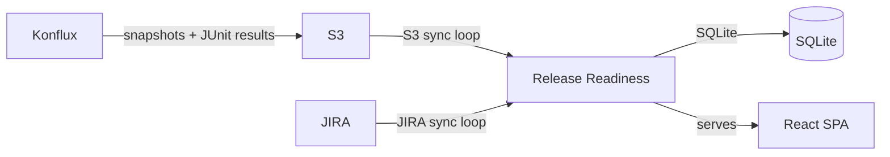

# Release Readiness Dashboard

Tracks build snapshots, integration test results, and JIRA issues across Quay release versions.

## Architecture



The Go backend runs two background sync loops that pull data into a local SQLite database. The React SPA is embedded into the binary and served directly by the backend.

## Syncing

### S3 sync (default: every 30s)

Polls S3 for new Konflux snapshots. For each new snapshot it parses `snapshot.json` (a Konflux Snapshot CR) and any JUnit XML test results, then persists them to SQLite.

### JIRA sync (default: every 5m)

Discovers active releases by querying for JIRA issues with the `-area/release` component that are not Closed/Done. Parses the version from the ticket summary (e.g. "Release Quay v3.16.2") and syncs all issues matching that `fixVersion` (and optionally the Target Version custom field).

## S3 bucket layout

```
{bucket}/
  {application}/                    # e.g. quay-v3-16, omr-v2-0
    snapshots/
      {snapshot-name}/
        snapshot.json               # Konflux Snapshot CR
        junit/
          {scenario}/
            *.xml                   # JUnit test results
```

## JIRA expectations

- **Release discovery** — searches for issues where `component = "-area/release"` and status is not Closed/Done
- **Version parsing** — extracts the product and version from the ticket summary (e.g. "Release Quay v3.16.2")
- **Issue sync** — fetches all issues matching the discovered `fixVersion` (format: `{product}-v{version}`, e.g. `quay-v3.16.2`)
- **Target Version** — optionally reads a custom field (`customfield_12319940` by default) for additional version targeting

## Running the application

### Build

```bash
# Backend
go build -o release-readiness ./cmd/release-readiness/

# Frontend
cd web && npm install && npm run build
```

### CLI flags

| Flag | Env var | Default | Description |
|------|---------|---------|-------------|
| `-addr` | — | `:8080` | Listen address |
| `-db` | — | `dashboard.db` | SQLite database path |
| `-s3-endpoint` | `S3_ENDPOINT` | — | S3 endpoint URL |
| `-s3-region` | `S3_REGION` | `us-east-1` | S3 region |
| `-s3-bucket` | `S3_BUCKET` | — | S3 bucket name (required to enable S3 sync) |
| `-s3-access-key` | `AWS_ACCESS_KEY_ID` | — | S3 access key |
| `-s3-secret-key` | `AWS_SECRET_ACCESS_KEY` | — | S3 secret key |
| `-s3-poll-interval` | — | `30s` | S3 sync poll interval |
| `-jira-url` | `JIRA_URL` | `https://issues.redhat.com` | JIRA server URL |
| `-jira-token` | `JIRA_TOKEN` | — | JIRA personal access token (required to enable JIRA sync) |
| `-jira-project` | `JIRA_PROJECT` | `PROJQUAY` | JIRA project key |
| `-jira-target-version-field` | `JIRA_TARGET_VERSION_FIELD` | `customfield_12319940` | JIRA custom field for Target Version |
| `-jira-poll-interval` | — | `5m` | JIRA sync poll interval |

### Local development

```bash
# Start backend
./release-readiness -addr :8088 -db release-readiness.db \
  -s3-endpoint http://localhost:3900 -s3-region garage \
  -s3-bucket quay-release-readiness \
  -s3-access-key $AWS_ACCESS_KEY_ID -s3-secret-key $AWS_SECRET_ACCESS_KEY \
  -jira-token $JIRA_TOKEN

# In a separate terminal, start the Vite dev server (proxies /api to localhost:8088)
cd web && npm run dev
```
