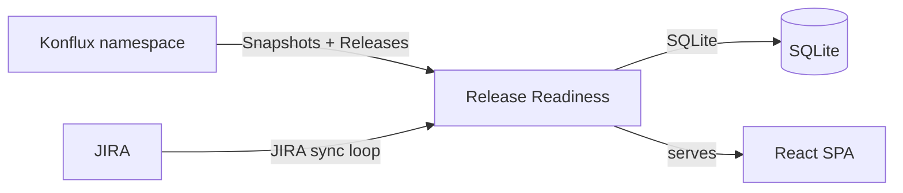

# Release Readiness Dashboard

Tracks Konflux build snapshots and releases, and JIRA issues, across Quay release versions.

## Architecture


```mermaid
flowchart LR
    Konflux[Konflux namespace] -->|Snapshots + Releases| App[Release Readiness]
    JIRA -->|JIRA sync loop| App
    App -->|SQLite| DB[(SQLite)]
    App -->|serves| SPA[React SPA]
```

The Go backend runs background sync loops that pull data into a local SQLite database. The React SPA is embedded into the binary and served directly by the backend.

## Syncing

### Konflux sync (default: every 30s)

Lists `Snapshot` and `Release` resources (`appstudio.redhat.com/v1alpha1`) in the `-namespace` Konflux namespace through the Kubernetes API, using `-kubeconfig`/`KUBECONFIG` or, when unset, the in-cluster service account. New snapshots are stored with their component images; releases are upserted. Each record's `created_at` is the resource's `creationTimestamp`.

Test results are not ingested.

### JIRA sync (default: every 5m)

Discovers active releases by querying for JIRA issues with the `-area/release` component that are not Closed/Done. Parses the version from the ticket summary (e.g. "Release Quay v3.16.2") and syncs all issues whose Target Version equals the release version (e.g. `quay-v3.16.2`), and the issues of its .z stream Target Version (e.g. `quay-v3.16.z`).

### Prow sync (default: every 15m, only when jobs are configured)

Lists the runs of each `-prow-jobs` periodic in the public `test-platform-results-public` GCS bucket and stores each run's state, Prow link and, once the run has finished, the images its `tested-images.json` names. A job maps to a Konflux application, so every z-stream of a minor (`quay-v3.18.1`, `quay-v3.18.2`) shows the same runs. The deployment ingests the install periodics whose `quay-gather` step publishes `tested-images.json`: for 3.18, AWS (ODF, S3, S3 FIPS, arm64, OCP 4.14, OCP 5.0), Azure Blob, GCP GCS and s390x libvirt; for 3.17, AWS S3.

A run counts as testing a Snapshot component only on an exact (role, manifest digest) match: `quay-X-Y-quay-{quay,clair,builder,builder-qemu,operator,operator-bundle}` against the matching role, and `fbc-quay-X-Y-quay-operator` against the catalog.

### Sync status

`/api/v1/sync-status` lists as `problems` each enabled sync (`konflux`, `jira`, `art-builds`, `catalog`, `prow`, `github-evidence`, `image-scans`) whose last pass failed or that has had no success within 3 poll intervals (at least 10 minutes); the header shows a warning icon while any exist.

## Release view

Each JIRA release maps to a Konflux application by major.minor version: fixVersion `quay-v3.16.2` maps to `quay-3-16`, and `omr-v2.0.10` to `omr-2-0`.

A Quay version's builds are its application's stream Snapshots (not ART's assemblies or `fbc-ri-*` re-releases) whose images, base image excluded, carry that version in the NVR ART build history resolved for them: `quay-quay-container-3.18.1-...` is 3.18.1. Unresolved images do not count, a build carrying two versions, as while ART switches the stream, is of none, and a build counts only if ART built no lower version after it.

`/api/v1/releases/{version}/candidate` returns the version's `candidate`, its selected STAGE build (`source` `staged`) else its newest build (`newest`), or null with the `reason`, e.g. `no build of 3.18.2 yet`. Each of its `builds` has a `stage` whose `not_staged` lists the images in no Snapshot a STAGE Release succeeded with; of those in no STAGE Release at all, `no_bundle` lists the ones whose bundle in the build is staged (ART builds an operator's bundle only after a clean build-layered-products run) and `no_release` the others. On `/api/v1/releases/overview`, a version's `latest_build` is when the newer of its newest build and its STAGE build was created, omitted when it has neither.

`/api/v1/releases/{version}/build-tickets` checks the version's tickets against its candidate, the build `/candidate` selects: `build` holds its `snapshot` and `source` (`staged` or `newest`), or is null with the `reason` (`shipped`, `archived`, or why there is no build) for a version that is then not scanned. A ticket's `in_build` holds the candidate commits whose message names its key: the commits each component's upstream commit gained after its branch left the repo's default branch. The list is the version's Target Version tickets, plus the tickets of its .z stream that a candidate commit new since the previous version names. The previous version is the highest lower Z of the same X.Y that is not archived. When it is unshipped and has a candidate, a component's new commits are those after the same component's commit in that candidate, if GitHub shows that commit is its ancestor (`z_since` then names the previous version); otherwise they are its `in_build` commits. A Target Version ticket no candidate commit names has in `not_in_build` the default-branch commits the candidate lacks that name it, shown as "Not in build", but only when every component's commits and those were read completely. Commits are read in the background through the GitHub compare API, the default branch's only for versions with Target Version tickets and at most hourly; `not_compared` lists the components whose commits were not read, with the reason, prefixed `default branch: ` for the default branch's. An empty `in_build` and `not_in_build`, shown as "-", means no compared commit names the ticket; it does not prove the change is absent.

## JIRA expectations

- **Release discovery** — searches for issues where `component = "-area/release"` and status is not Closed/Done
- **Version parsing** — extracts the product and version from the ticket summary (e.g. "Release Quay v3.16.2")
- **Issue sync** — fetches all issues whose Target Version equals the release version (format: `{product}-v{version}`, e.g. `quay-v3.16.2`)

## Running the application

### Build

```bash
# Backend
go build -o release-readiness ./cmd/release-readiness/

# Frontend
cd web && npm install && npm run build
```

### CLI flags

| Flag | Env var | Default | Description |
|------|---------|---------|-------------|
| `-addr` | — | `:8080` | Listen address |
| `-db` | — | `dashboard.db` | SQLite database path |
| `-kubeconfig` | `KUBECONFIG` | — | Kubeconfig path (empty uses the in-cluster service account) |
| `-namespace` | `KONFLUX_NAMESPACE` | `art-quay-tenant` | Konflux namespace to read Snapshots and Releases from |
| `-konflux-poll-interval` | — | `30s` | Konflux sync poll interval |
| `-art-build-history-url` | — | `https://art-build-history-art-build-history.apps.artc2023.pc3z.p1.openshiftapps.com` | ART build history service; component images are looked up there in the background for build and upstream commit links (empty disables) |
| `-jira-url` | `JIRA_URL` | `https://redhat.atlassian.net` | JIRA Cloud URL |
| `-jira-api-url` | `JIRA_API_URL` | `-jira-url` | JIRA REST API base URL; set to `https://api.atlassian.com/ex/jira/<cloudId>` for scoped API tokens |
| `-jira-email` | `JIRA_EMAIL` | — | JIRA Cloud account email for API token auth |
| `-jira-token` | `JIRA_TOKEN` | — | JIRA Cloud API token (required to enable JIRA sync) |
| `-jira-project` | `JIRA_PROJECT` | `PROJQUAY` | JIRA project key |
| `-jira-poll-interval` | — | `5m` | JIRA sync poll interval |
| `-stage-release-plan-pattern` | `STAGE_RELEASE_PLAN_PATTERN` | `^quay-advisory-stage-\d+-\d+$` | Regexp matching the Konflux ReleasePlan names whose successful Releases are image STAGE builds (empty selects no staged build and disables the GitHub evidence scan) |
| `-github-token` | `GITHUB_TOKEN` | — | Read-only GitHub token for the candidate build commit compares (optional; anonymous reads allow 60 requests an hour) |
| `-prow-jobs` | `PROW_JOBS` | — | Periodic Prow jobs to ingest, as `job_name=konflux_application[,...]`, e.g. `periodic-ci-quay-quay-redhat-3.18-aws-ocp422-e2e-install-aws-s3-nightly=quay-3-18` |
| `-prow-interval` | — | `15m` | Prow sync poll interval |
| `-catalog-url` | — | `https://catalog.redhat.com/api/containers/v1` | Red Hat container catalog API, checked hourly in the background to mark versions shipped (empty leaves JIRA's released flag as the only shipped signal) |

### Local development

```bash
# Start backend (the kubeconfig needs read access to Snapshots and Releases in the namespace)
KUBECONFIG=<path> go run ./cmd/release-readiness -addr :8088 -db /tmp/rr.db

# In a separate terminal, start the Vite dev server (proxies /api to localhost:8088)
cd web && npm run dev
```

### Deployment

`deploy/rbac.yaml` creates the `release-readiness` ServiceAccount and a Role granting read-only access to Snapshots and Releases. The Role and RoleBinding must live in the Konflux namespace the app reads.

### Upgrading

The schema changed when the Konflux source moved to Kubernetes. Delete the old SQLite database file before upgrading; it is recreated on startup.
